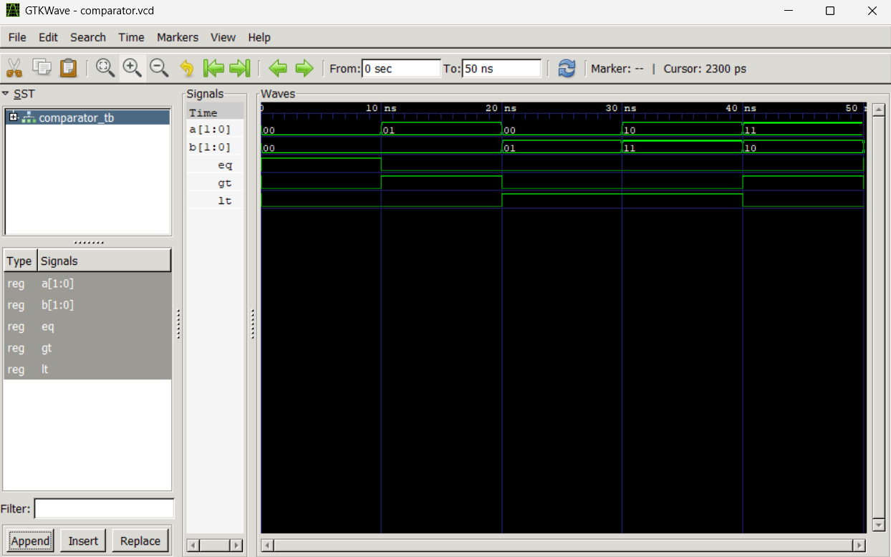

# Lab 5: VHDL Code for Combinational Circuits — Comparator

**Course:** Computer Architecture (CMP 262)
**Program:** Bachelor of Computer Engineering
**Semester:** Fourth Semester
**College:** Cosmos College of Management and Technology
**Department:** Department of Information and Communication Technology

---

## Objective

- To design and simulate a 2-bit magnitude comparator in VHDL.
- To understand how comparison operations are implemented in hardware.

---

## Theory

A magnitude comparator is a combinational circuit that compares two binary numbers and determines their relationship. For two 2-bit inputs **A = A1A0** and **B = B1B0**, the comparator produces three mutually exclusive output signals:

| Output | Condition | Description |
|--------|-----------|-------------|
| **EQ** | A = B | HIGH when both inputs are equal |
| **GT** | A > B | HIGH when A is greater than B |
| **LT** | A < B | HIGH when A is less than B |

The Boolean expressions for each output are:

```
EQ = (A1 ⊕ B1)' · (A0 ⊕ B0)'
GT = A1·B1' + (A1 ⊕ B1)' · A0·B0'
LT = A1'·B1 + (A1 ⊕ B1)' · A0'·B0
```

In VHDL, the comparator is implemented using the **Behavioral** modeling style with a `process` block and `if-elsif-else` statements. The `NUMERIC_STD` library is used to cast `std_logic_vector` inputs to `unsigned` type, enabling direct arithmetic comparison using standard relational operators (`=`, `>`, `<`).

### Expected Truth Table

| A  | B  | EQ | GT | LT |
|----|----|----|----|----|
| 00 | 00 |  1 |  0 |  0 |
| 01 | 00 |  0 |  1 |  0 |
| 00 | 01 |  0 |  0 |  1 |
| 10 | 11 |  0 |  0 |  1 |
| 11 | 10 |  0 |  1 |  0 |
| 11 | 11 |  1 |  0 |  0 |

---

## Design File

**Filename:** `comparator_2bit.vhd`

```vhdl
library IEEE;
use IEEE.STD_LOGIC_1164.ALL;
use IEEE.NUMERIC_STD.ALL;

entity COMPARATOR_2BIT is
    port (
        A  : in  std_logic_vector(1 downto 0);
        B  : in  std_logic_vector(1 downto 0);
        EQ : out std_logic; -- A = B
        GT : out std_logic; -- A > B
        LT : out std_logic  -- A < B
    );
end entity COMPARATOR_2BIT;

architecture Behavioral of COMPARATOR_2BIT is
begin
    process(A, B)
    begin
        -- EQ = (A1 ⊕ B1)' · (A0 ⊕ B0)'
        EQ <= not (A(1) xor B(1)) and not (A(0) xor B(0));

        -- GT = A1·B1' + (A1 ⊕ B1)' · A0·B0'
        GT <= (A(1) and not B(1)) or (not (A(1) xor B(1)) and A(0) and not B(0));

        -- LT = A1'·B1 + (A1 ⊕ B1)' · A0'·B0
        LT <= (not A(1) and B(1)) or (not (A(1) xor B(1)) and not A(0) and B(0));
    end process;
end architecture Behavioral;

```

---

## Testbench File

**Filename:** `comparator_tb.vhd`

```vhdl
library IEEE;
use IEEE.STD_LOGIC_1164.ALL;

entity COMPARATOR_TB is
end entity COMPARATOR_TB;

architecture Simulation of COMPARATOR_TB is
    signal A, B        : std_logic_vector(1 downto 0) := "00";
    signal EQ, GT, LT  : std_logic;
begin
    DUT : entity work.COMPARATOR_2BIT
        port map (A => A, B => B, EQ => EQ, GT => GT, LT => LT);

    STIMULUS : process
    begin
        A <= "00"; B <= "00"; wait for 10 ns;  -- EQ = 1
        A <= "01"; B <= "00"; wait for 10 ns;  -- GT = 1
        A <= "00"; B <= "01"; wait for 10 ns;  -- LT = 1
        A <= "10"; B <= "11"; wait for 10 ns;  -- LT = 1
        A <= "11"; B <= "10"; wait for 10 ns;  -- GT = 1
        A <= "11"; B <= "11"; wait for 10 ns;  -- EQ = 1
        wait;
    end process;
end architecture Simulation;
```

### Simulation Commands

```bash
# 1. Analyze design and testbench
ghdl -a comparator_2bit.vhd comparator_tb.vhd

# 2. Elaborate the testbench
ghdl -e COMPARATOR_TB

# 3. Simulate and export waveform
ghdl -r COMPARATOR_TB --vcd=comparator.vcd

# 4. Open waveform in GTKWave
gtkwave comparator.vcd
```

---

## Simulation File

**Filename:** `comparator.vcd`

Generated by GHDL after running the testbench. This Value Change Dump (VCD) file records all transitions of inputs `A`, `B` and outputs `EQ`, `GT`, `LT` across the six stimulus intervals. It is loaded into GTKWave for visual verification against the expected truth table.

---

## Output

The waveform was loaded in GTKWave. Signals `A`, `B`, `EQ`, `GT`, and `LT` were appended and the display was zoomed to fit.





**Observation:** For all six input combinations, exactly one of the three output signals (`EQ`, `GT`, or `LT`) was HIGH at any given time, and all outputs matched the expected truth table, confirming correct comparator behavior.

---

## Discussion and Conclusion

This lab demonstrated the design and simulation of a 2-bit magnitude comparator in VHDL using the Behavioral modeling style. The use of the `NUMERIC_STD` library allowed straightforward comparison of `std_logic_vector` inputs by casting them to `unsigned` type. The testbench covered all relevant comparison cases and the GTKWave waveform confirmed that the outputs `EQ`, `GT`, and `LT` were correctly asserted for every input combination. This lab provided practical experience with conditional signal assignment in VHDL and highlighted how arithmetic comparison operations are realized in hardware.
