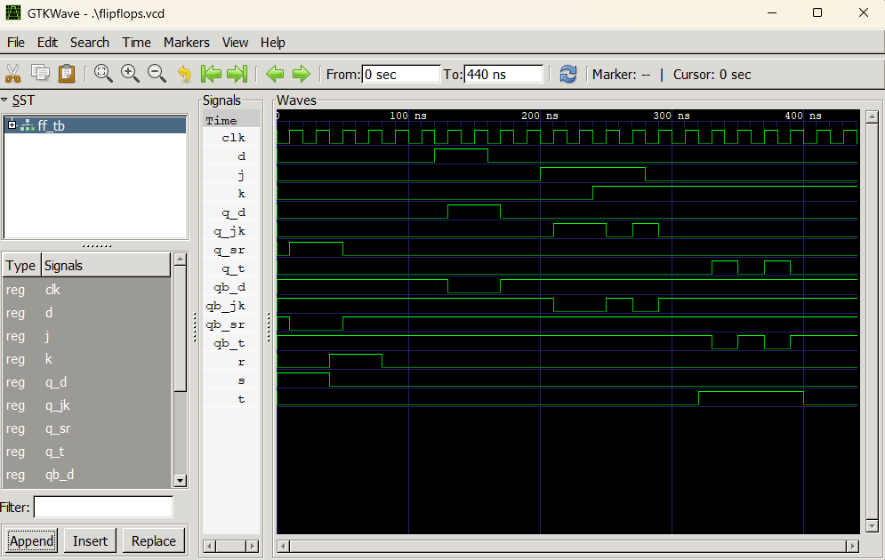

# Lab 7: VHDL Code for Sequential Circuits — Flip-Flops

---

## Objective

- To design and simulate SR, D, JK, and T flip-flops in VHDL.
- To understand the role of the clock signal in sequential circuits.

---

## Theory

A flip-flop is a bistable sequential element that stores one bit of state. Unlike combinational circuits, the output of a flip-flop depends on both the current inputs **and** its previous state. All flip-flops in this lab are triggered on the **rising edge** of the clock signal.

---

### SR Flip-Flop

The SR flip-flop has two inputs: Set (S) and Reset (R). The forbidden state occurs when both S and R are HIGH simultaneously.

| S   | R   | Q (next)      |
| --- | --- | ------------- |
| 0   | 0   | Q (no change) |
| 0   | 1   | 0 (reset)     |
| 1   | 0   | 1 (set)       |
| 1   | 1   | X (forbidden) |

---

### D Flip-Flop

The D flip-flop captures the value of input D on every rising clock edge. It eliminates the forbidden state of the SR flip-flop.

```
Q(next) = D
```

---

### JK Flip-Flop

The JK flip-flop eliminates the forbidden state of the SR flip-flop. When J = K = 1, the output **toggles**.

```
Q(next) = J·Q' + K'·Q
```

| J   | K   | Q (next)      |
| --- | --- | ------------- |
| 0   | 0   | Q (no change) |
| 0   | 1   | 0 (reset)     |
| 1   | 0   | 1 (set)       |
| 1   | 1   | Q' (toggle)   |

---

### T Flip-Flop

The T (Toggle) flip-flop toggles its output when T = 1 and holds its state when T = 0.

```
Q(next) = T ⊕ Q
```

| T   | Q (next)      |
| --- | ------------- |
| 0   | Q (no change) |
| 1   | Q' (toggle)   |

---

## Design Files

### 1. SR Flip-Flop

**Filename:** `sr_ff.vhd`

```vhdl
library IEEE;
use IEEE.STD_LOGIC_1164.ALL;

entity SR_FF is
    port (
        CLK : in  std_logic;
        S   : in  std_logic;
        R   : in  std_logic;
        Q   : out std_logic;
        QB  : out std_logic  -- Q complement
    );
end entity SR_FF;

architecture Behavioral of SR_FF is
    signal Q_int : std_logic := '0';
begin
    process (CLK)
    begin
        if rising_edge(CLK) then
            if    S = '0' and R = '0' then null;        -- Hold
            elsif S = '0' and R = '1' then Q_int <= '0'; -- Reset
            elsif S = '1' and R = '0' then Q_int <= '1'; -- Set
            -- S=1, R=1 is forbidden: no assignment
            end if;
        end if;
    end process;

    Q  <= Q_int;
    QB <= not Q_int;
end architecture Behavioral;
```

---

### 2. D Flip-Flop

**Filename:** `d_ff.vhd`

```vhdl
library IEEE;
use IEEE.STD_LOGIC_1164.ALL;

entity D_FF is
    port (
        CLK : in  std_logic;
        D   : in  std_logic;
        Q   : out std_logic;
        QB  : out std_logic
    );
end entity D_FF;

architecture Behavioral of D_FF is
    signal Q_int : std_logic := '0';
begin
    process (CLK)
    begin
        if rising_edge(CLK) then
            Q_int <= D;
        end if;
    end process;

    Q  <= Q_int;
    QB <= not Q_int;
end architecture Behavioral;
```

---

### 3. JK Flip-Flop

**Filename:** `jk_ff.vhd`

```vhdl
library IEEE;
use IEEE.STD_LOGIC_1164.ALL;

entity JK_FF is
    port (
        CLK : in  std_logic;
        J   : in  std_logic;
        K   : in  std_logic;
        Q   : out std_logic;
        QB  : out std_logic
    );
end entity JK_FF;

architecture Behavioral of JK_FF is
    signal Q_int : std_logic := '0';
begin
    process (CLK)
    begin
        if rising_edge(CLK) then
            if    J = '0' and K = '0' then null;              -- Hold
            elsif J = '0' and K = '1' then Q_int <= '0';      -- Reset
            elsif J = '1' and K = '0' then Q_int <= '1';      -- Set
            else                           Q_int <= not Q_int; -- Toggle
            end if;
        end if;
    end process;

    Q  <= Q_int;
    QB <= not Q_int;
end architecture Behavioral;
```

---

### 4. T Flip-Flop

**Filename:** `t_ff.vhd`

```vhdl
library IEEE;
use IEEE.STD_LOGIC_1164.ALL;

entity T_FF is
    port (
        CLK : in  std_logic;
        T   : in  std_logic;
        Q   : out std_logic;
        QB  : out std_logic
    );
end entity T_FF;

architecture Behavioral of T_FF is
    signal Q_int : std_logic := '0';
begin
    process (CLK)
    begin
        if rising_edge(CLK) then
            if T = '1' then
                Q_int <= not Q_int;  -- Toggle
            end if;
        end if;
    end process;

    Q  <= Q_int;
    QB <= not Q_int;
end architecture Behavioral;
```

---

## Testbench File

**Filename:** `ff_tb.vhd`

A single combined testbench instantiates all four flip-flops simultaneously. A continuous clock of 20 ns period is generated using a concurrent signal assignment. The stimulus process applies test sequences for each flip-flop covering all valid input conditions — Set, Reset, Hold, and Toggle — each held for 40 ns (two clock cycles) to ensure edge-triggered capture.

```vhdl
library IEEE;
use IEEE.STD_LOGIC_1164.ALL;

entity FF_TB is
end entity FF_TB;

architecture Simulation of FF_TB is
    signal CLK                          : std_logic := '0';
    signal S, R                         : std_logic := '0';
    signal D                            : std_logic := '0';
    signal J, K                         : std_logic := '0';
    signal T                            : std_logic := '0';
    signal Q_SR, Q_D, Q_JK, Q_T        : std_logic;
    signal QB_SR, QB_D, QB_JK, QB_T    : std_logic;

    constant CLK_PERIOD : time := 20 ns;
begin
    -- Clock generation
    CLK <= not CLK after CLK_PERIOD / 2;

    U1 : entity work.SR_FF port map (CLK, S, R, Q_SR, QB_SR);
    U2 : entity work.D_FF  port map (CLK, D, Q_D, QB_D);
    U3 : entity work.JK_FF port map (CLK, J, K, Q_JK, QB_JK);
    U4 : entity work.T_FF  port map (CLK, T, Q_T, QB_T);

    STIMULUS : process
    begin
        -- SR FF test
        S <= '1'; R <= '0'; wait for 40 ns;  -- Set
        S <= '0'; R <= '1'; wait for 40 ns;  -- Reset
        S <= '0'; R <= '0'; wait for 40 ns;  -- Hold

        -- D FF test
        D <= '1'; wait for 40 ns;
        D <= '0'; wait for 40 ns;

        -- JK FF test
        J <= '1'; K <= '0'; wait for 40 ns;  -- Set
        J <= '1'; K <= '1'; wait for 40 ns;  -- Toggle
        J <= '0'; K <= '1'; wait for 40 ns;  -- Reset

        -- T FF test
        T <= '1'; wait for 80 ns;  -- Toggle twice
        T <= '0'; wait for 40 ns;  -- Hold

        wait;
    end process;
end architecture Simulation;
```

### Simulation Commands

```bash
# 1. Analyze all design files and testbench
ghdl -a sr_ff.vhd d_ff.vhd jk_ff.vhd t_ff.vhd ff_tb.vhd

# 2. Elaborate the testbench
ghdl -e FF_TB

# 3. Simulate and export waveform
ghdl -r FF_TB --vcd=flipflops.vcd

# 4. Open waveform in GTKWave
gtkwave flipflops.vcd
```

---

## Simulation File

**Filename:** `flipflops.vcd`

Generated by GHDL after running the testbench. This Value Change Dump (VCD) file records all clock, input, and output signal transitions for all four flip-flops across the full simulation period. It is loaded into GTKWave for visual verification of each flip-flop's behavior.

---

## Output

The waveform was loaded in GTKWave. The clock signal and all flip-flop inputs and outputs were appended and the display was zoomed to fit.



**Observation:** All four flip-flops responded correctly to their respective input conditions on each rising clock edge. The SR flip-flop set and reset correctly while avoiding the forbidden state. The D flip-flop captured the input value on every rising edge. The JK flip-flop toggled correctly when J = K = 1. The T flip-flop toggled on every rising edge when T = 1 and held its state when T = 0. All QB outputs were always the complement of Q.

---

## Discussion and Conclusion

This lab demonstrated the design and simulation of four fundamental sequential circuit elements — SR, D, JK, and T flip-flops — in VHDL using the Behavioral modeling style. All four designs used a rising-edge-triggered clock and an internal signal to drive both Q and QB outputs. A single combined testbench with a generated clock and sequential stimulus process was used to verify all valid input conditions for each flip-flop. The GTKWave waveform confirmed correct behavior in all cases, including state holding, setting, resetting, and toggling. This lab established a foundational understanding of clocked sequential circuits that will be essential for designing registers, counters, and finite state machines in subsequent labs.
