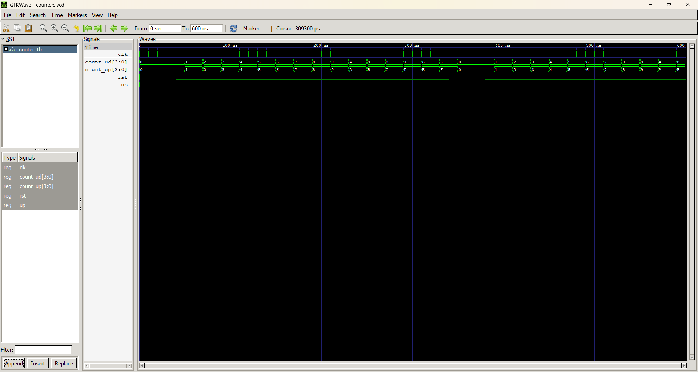

# Lab 8: VHDL Code for Sequential Circuits — Counters

**Course:** Computer Architecture (CMP 262)
**Program:** Bachelor of Computer Engineering
**Semester:** Fourth Semester
**College:** Cosmos College of Management and Technology
**Department:** Department of Information and Communication Technology

---

## Objective

- To design and simulate a 4-bit synchronous up counter in VHDL.
- To design and simulate a 4-bit synchronous up/down counter in VHDL.

---

## Theory

A counter is a sequential circuit that cycles through a predefined sequence of states on each clock edge. Counters are built from flip-flops and are fundamental to timing, sequencing, and frequency division.

| Term | Description |
|------|-------------|
| **Synchronous Counter** | All flip-flops are clocked simultaneously — faster and more reliable than ripple (asynchronous) counters. |
| **Up Counter** | Increments the count by 1 on each rising clock edge. |
| **Up/Down Counter** | Increments or decrements based on a direction control signal (`UP`). |
| **Reset** | An active-high synchronous reset returns the count to zero on the next rising clock edge. |

A 4-bit counter cycles through values 0 to 15 (0000 to 1111 in binary). On reaching 15, an up counter wraps back to 0 on the next clock edge. Similarly, a down counter wraps from 0 back to 15.

Both counters in this lab use the `NUMERIC_STD` library to perform unsigned arithmetic on an internal `unsigned` signal, which is then converted back to `std_logic_vector` for the output port.

---

## Design Files

### 1. 4-bit Synchronous Up Counter

**Filename:** `counter_up.vhd`

```vhdl
library IEEE;
use IEEE.STD_LOGIC_1164.ALL;
use IEEE.NUMERIC_STD.ALL;

entity COUNTER_UP is
    port (
        CLK   : in  std_logic;
        RST   : in  std_logic;  -- Active-high synchronous reset
        COUNT : out std_logic_vector(3 downto 0)
    );
end entity COUNTER_UP;

architecture Behavioral of COUNTER_UP is
    signal count_int : unsigned(3 downto 0) := (others => '0');
begin
    process (CLK)
    begin
        if rising_edge(CLK) then
            if RST = '1' then
                count_int <= (others => '0');
            else
                count_int <= count_int + 1;
            end if;
        end if;
    end process;

    COUNT <= std_logic_vector(count_int);
end architecture Behavioral;
```

---

### 2. 4-bit Synchronous Up/Down Counter

**Filename:** `counter_updown.vhd`

```vhdl
library IEEE;
use IEEE.STD_LOGIC_1164.ALL;
use IEEE.NUMERIC_STD.ALL;

entity COUNTER_UPDOWN is
    port (
        CLK   : in  std_logic;
        RST   : in  std_logic;  -- Active-high synchronous reset
        UP    : in  std_logic;  -- '1' = count up, '0' = count down
        COUNT : out std_logic_vector(3 downto 0)
    );
end entity COUNTER_UPDOWN;

architecture Behavioral of COUNTER_UPDOWN is
    signal count_int : unsigned(3 downto 0) := (others => '0');
begin
    process (CLK)
    begin
        if rising_edge(CLK) then
            if RST = '1' then
                count_int <= (others => '0');
            elsif UP = '1' then
                count_int <= count_int + 1;
            else
                count_int <= count_int - 1;
            end if;
        end if;
    end process;

    COUNT <= std_logic_vector(count_int);
end architecture Behavioral;
```

---

## Testbench File

**Filename:** `counter_tb.vhd`

A single combined testbench instantiates both counters simultaneously and drives them with a shared clock (20 ns period) and reset signal. The stimulus process first resets both counters, then counts up for 10 clock cycles (200 ns), counts down for 5 clock cycles (100 ns), resets again, and counts up once more for verification.

```vhdl
library IEEE;
use IEEE.STD_LOGIC_1164.ALL;

entity COUNTER_TB is
end entity COUNTER_TB;

architecture Simulation of COUNTER_TB is
    signal CLK      : std_logic := '0';
    signal RST      : std_logic := '0';
    signal UP       : std_logic := '1';
    signal COUNT_UP : std_logic_vector(3 downto 0);
    signal COUNT_UD : std_logic_vector(3 downto 0);

    constant CLK_PERIOD : time := 20 ns;
begin
    -- Clock generation
    CLK <= not CLK after CLK_PERIOD / 2;

    U1 : entity work.COUNTER_UP
        port map (CLK => CLK, RST => RST, COUNT => COUNT_UP);

    U2 : entity work.COUNTER_UPDOWN
        port map (CLK => CLK, RST => RST, UP => UP, COUNT => COUNT_UD);

    STIMULUS : process
    begin
        -- Reset both counters
        RST <= '1'; wait for 40 ns;
        RST <= '0';

        -- Count up for 10 clock cycles
        UP <= '1'; wait for 200 ns;

        -- Count down for 5 clock cycles
        UP <= '0'; wait for 100 ns;

        -- Reset and count up again
        RST <= '1'; wait for 40 ns;
        RST <= '0';
        UP  <= '1'; wait for 200 ns;

        wait;
    end process;
end architecture Simulation;
```

### Simulation Commands

```bash
# 1. Analyze all design files and testbench
ghdl -a counter_up.vhd counter_updown.vhd counter_tb.vhd

# 2. Elaborate the testbench
ghdl -e COUNTER_TB

# 3. Simulate and export waveform
ghdl -r COUNTER_TB --vcd=counters.vcd

# 4. Open waveform in GTKWave
gtkwave counters.vcd
```

> **GTKWave Tip:** After adding `CLK`, `RST`, `UP`, `COUNT_UP`, and `COUNT_UD` signals, right-click each COUNT signal and select **Data Format → Decimal** to display the count values in decimal for easier reading.

---

## Simulation File

**Filename:** `counters.vcd`

Generated by GHDL after running the testbench. This Value Change Dump (VCD) file records all transitions of the clock, reset, direction control, and both counter outputs across the full simulation period. It is loaded into GTKWave for visual verification of counting behavior.

---

## Output

The waveform was loaded in GTKWave. Signals `CLK`, `RST`, `UP`, `COUNT_UP`, and `COUNT_UD` were appended and COUNT signals were displayed in decimal format.



**Observation:** The up counter incremented from 0 to 15 continuously, wrapping back to 0 after each overflow. The up/down counter incremented correctly when `UP = '1'` and decremented correctly when `UP = '0'`. Both counters reset to 0 immediately on the next rising clock edge when `RST = '1'`, confirming correct synchronous reset behavior.

---

## Discussion and Conclusion

This lab demonstrated the design and simulation of two 4-bit synchronous counters in VHDL using the Behavioral modeling style. The up counter incremented its internal unsigned count on every rising clock edge, while the up/down counter used a direction control signal to switch between incrementing and decrementing modes. Both designs used a synchronous active-high reset to return the count to zero. The `NUMERIC_STD` library enabled clean arithmetic operations on `unsigned` signals with straightforward conversion to `std_logic_vector` for output. The GTKWave waveform confirmed correct counting, direction control, overflow wrapping, and reset behavior for both counters. This lab reinforced the practical application of sequential VHDL design and provided a foundation for building more complex state machines and timing circuits.